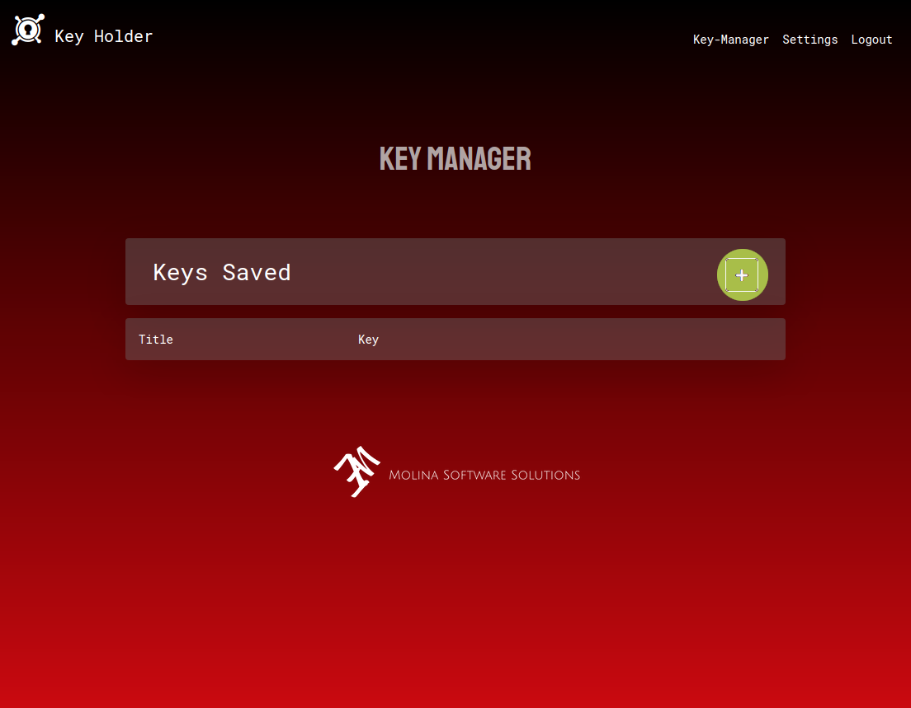
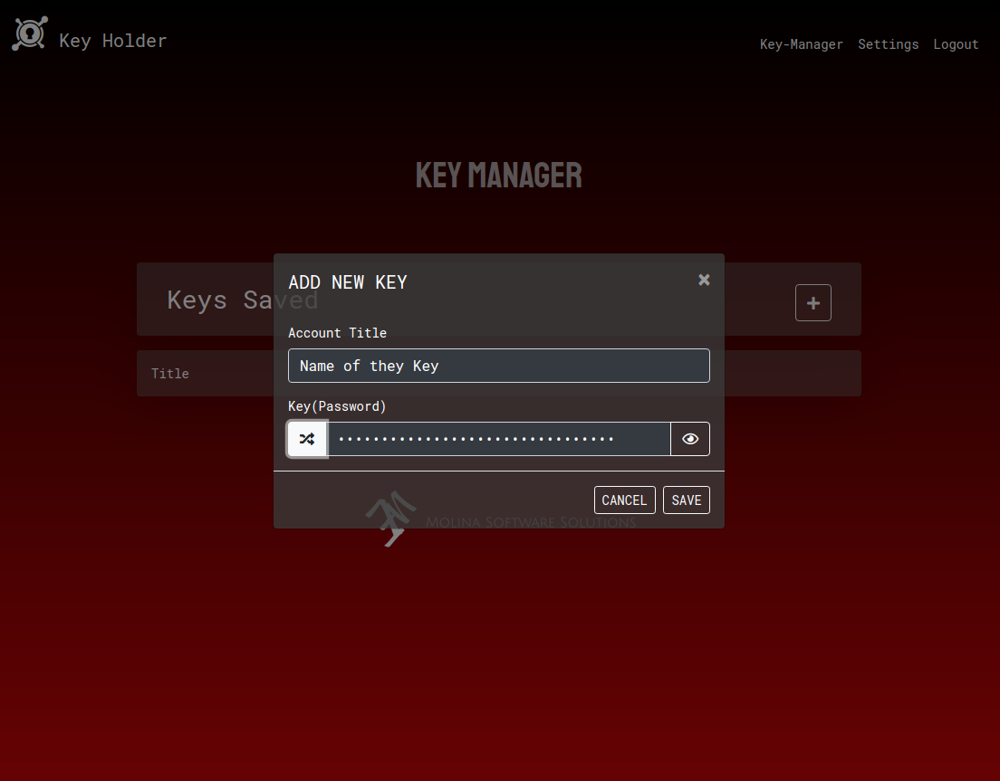
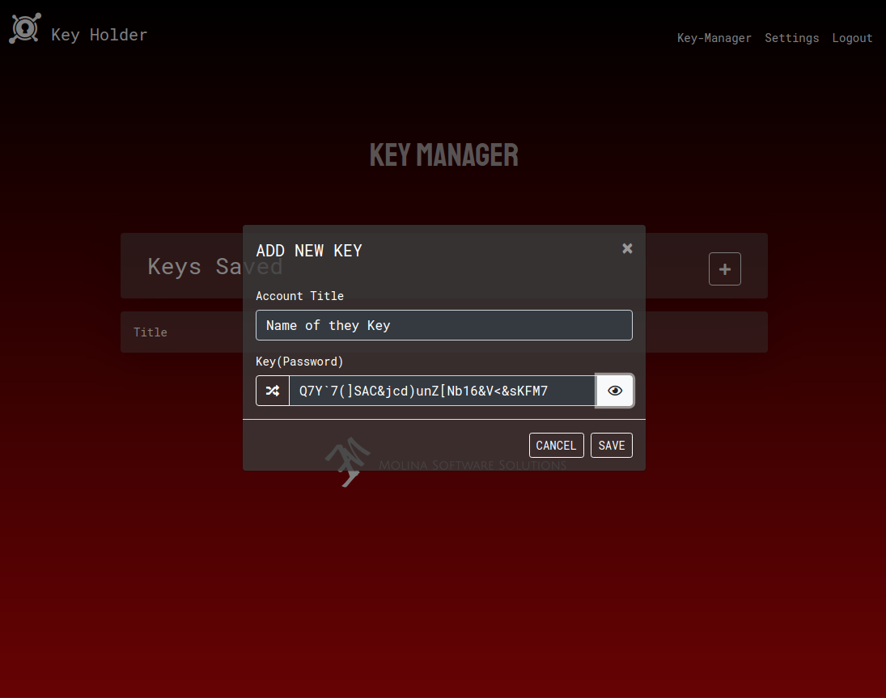
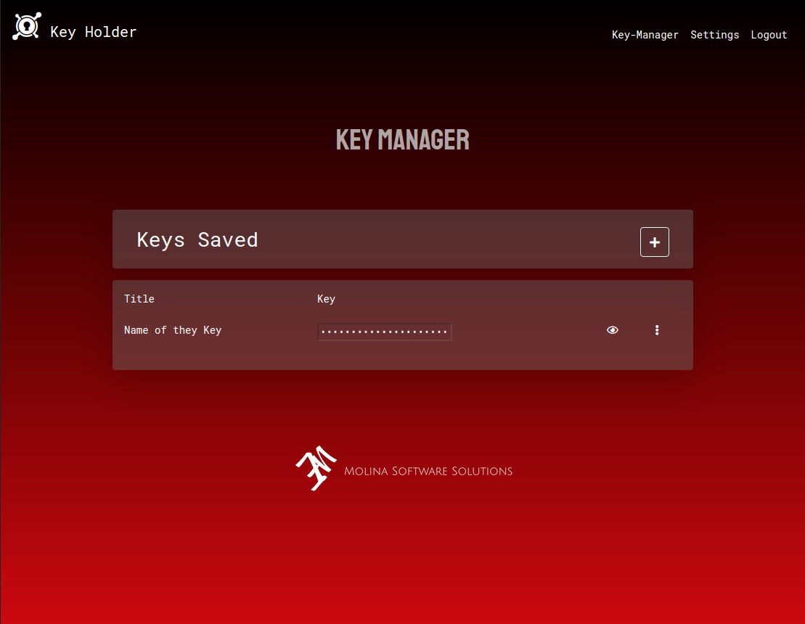
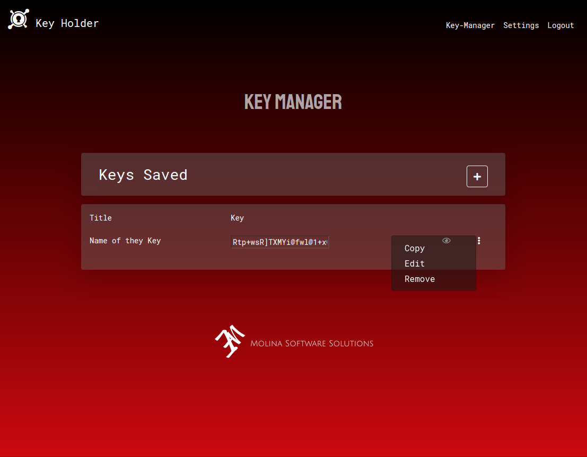
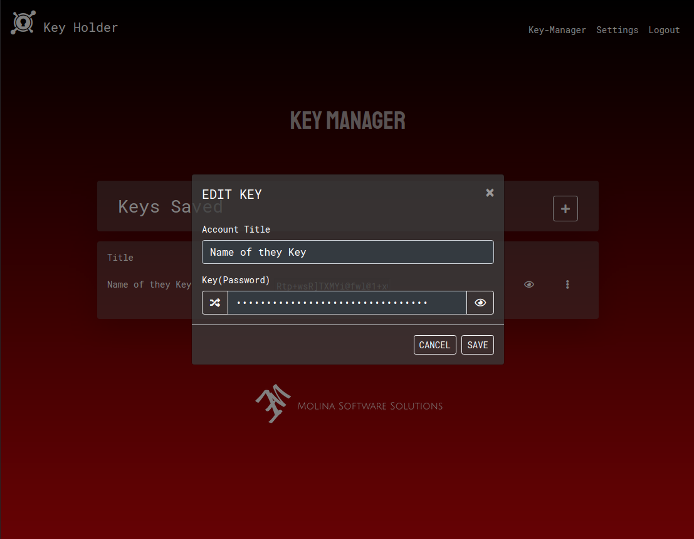

# [Key Holder](https://keyholder-molina.herokuapp.com/)

Express JS App designed to create and store keys.

## Details: 
I created this app to help me create complex passwords that are of a 32 bit size and randomized using valid characters as per [Princeton Department of Computer Science](https://csguide.cs.princeton.edu/accounts/passwords) guide to selecting a good password. And store each password in a database. Each password or Key is encrypted using aes-256-ctr before storing to the database.

## Technologies

1. Express
    - Passport
        - Used for User authentication
    - Sendgrid/mail
        - Used to send email with authentication token for password reset.
    - EJS
        - Was used as the view engine to serve a dynamic HTML5 page.

2. Mongoose
    - Used to store all user data.

3. Bootstrap 4
    - Grid system to organize all divs.
    - Navbar supplied bt bootstrap.
    - Button components.
    - Modal component.
    - Dropdown component.
    

## How to use
1. Create a new Key:
    1. To create a new Key. Click the big plus sign highlighted in the image below and a modal will appear.
    2. Label the new key with a name and type the key you'd like to save.
    3. If you wish to create a randomized 32 digit key click the shuffle button.
    4. To show the key created click the eye button.

    
    
    

2. Show Keys, Use Keys and Edit keys:
    1. In the Key-Manager page you will find all your Keys listed in a table.
    2. You may show them by clicking the eye button.
    3. By clicking the vertical ellipsis button you will receive a dropdown menu that will allow you to Copy, Edit and remove the key from your list.
    4. To edit, you will select the edit button and receive a modal similar to the create key modal.
    here you can change the name and key.

    
    
    